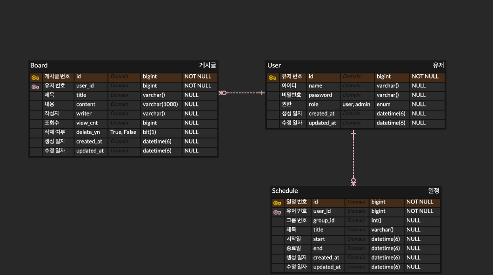

# 🏢 Enterprise-Intro
기업 소개 웹사이트 제작 프로젝트

## 📖 Table of Contents
- [Front-End](#front-end)
  - [기술 스택](#기술-스택)
- [Back-End](#back-end)
  - [기술 스택](#기술-스택-1)
- [DB](#db)
  - [ERD](#erd)
- [Structure](#structure)
- [Issue](#issue)
- [TODO](#todo)

## 🎨 Front-End
### 기술 스택
- Thymeleaf
- Toast UI Grid
- Full Calendar

## ⚙️ Back-End
### 기술 스택
- Java 11
- Spring 
- SpringBoot 2.7.14
- JPA
- Jackson
- Lombok

## 🗃️ DB
- User
- Board
- Schedule

### ERD

## 🪜Structure
Web UI(Browser) <-> Controller <-> Service <-> Repository(DAO) <-> DB(Entity)

DTO를 통해서 데이터 전달

---

## Issue
- Toast UI Grid API 전달 방법

## 🪛 TODO
- Toast Grid
  - Create, Update, Delete 버튼, API 생성
- Full Calendar
  - Create UI 리팩토링
  - Update 버튼, API 생성
  - Delete UI, Logic 리팩토링
- Spring Security 적용
  - 적용 대상
- DashBoard
  - UI 구현
  - 데이터 적용